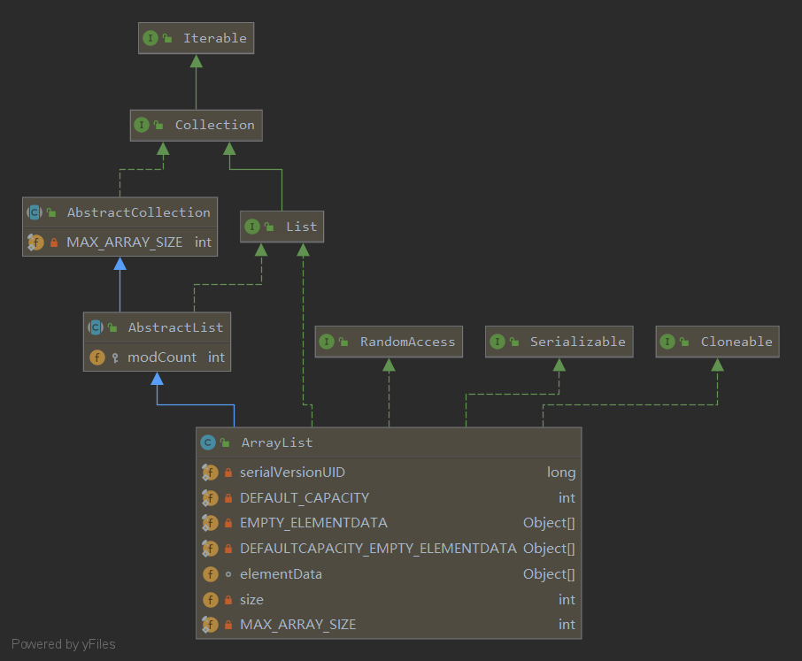

# 属性  



默认容量为10
private static final int DEFAULT_CAPACITY = 10;  
空实例
private static final Object[] EMPTY_ELEMENTDATA = {};   
默认空实例
private static final Object[] DEFAULTCAPACITY_EMPTY_ELEMENTDATA = {};
 /**
     * The array buffer into which the elements of the ArrayList are stored.
     * The capacity of the ArrayList is the length of this array buffer. Any
     * empty ArrayList with elementData == DEFAULTCAPACITY_EMPTY_ELEMENTDATA
     * will be expanded to DEFAULT_CAPACITY when the first element is added.
     */
transient Object[] elementData;    
//记录元素的个数
private int size;   

# 构造函数  
默认构造函数
```
 public ArrayList() {
        this.elementData = DEFAULTCAPACITY_EMPTY_ELEMENTDATA;
    }
```
指定容量构造函数：如果指定的初始容量大于0,则新建一个Object数组，如果等于0引用空实例数组
```
 public ArrayList(int initialCapacity) {
        if (initialCapacity > 0) {
            this.elementData = new Object[initialCapacity];
        } else if (initialCapacity == 0) {
            this.elementData = EMPTY_ELEMENTDATA;
        } else {
            throw new IllegalArgumentException("Illegal Capacity: "+
                                               initialCapacity);
        }
    }
```
 将其他collection的转换为ArrayList
 ```$xslt
public ArrayList(Collection<? extends E> c) {
        Object[] a = c.toArray();
        if ((size = a.length) != 0) {
            if (c.getClass() == ArrayList.class) {
                elementData = a;
            } else {
                elementData = Arrays.copyOf(a, size, Object[].class);
            }
        } else {
            // replace with empty array.
            elementData = EMPTY_ELEMENTDATA;
        }
    }
```

# 方法  
## 添加元素  
内部扩容，元素个数加1
```$xslt
 public boolean add(E e) {
        ensureCapacityInternal(size + 1);  // Increments modCount!!
        elementData[size++] = e;
        return true;
    }
```

```
 private void ensureCapacityInternal(int minCapacity) {
        ensureExplicitCapacity(calculateCapacity(elementData, minCapacity));
    }

private static int calculateCapacity(Object[] elementData, int minCapacity) {
        if (elementData == DEFAULTCAPACITY_EMPTY_ELEMENTDATA) {
            return Math.max(DEFAULT_CAPACITY, minCapacity);
        }
        return minCapacity;
    }

private void ensureExplicitCapacity(int minCapacity) {
        modCount++;

        // overflow-conscious code
        if (minCapacity - elementData.length > 0)  
            grow(minCapacity);
    }
//扩容原来容量的一半
 private void grow(int minCapacity) {
        // overflow-conscious code
        int oldCapacity = elementData.length;
        int newCapacity = oldCapacity + (oldCapacity >> 1);
        if (newCapacity - minCapacity < 0)
            newCapacity = minCapacity;
        if (newCapacity - MAX_ARRAY_SIZE > 0)
            newCapacity = hugeCapacity(minCapacity);
        // minCapacity is usually close to size, so this is a win:
        elementData = Arrays.copyOf(elementData, newCapacity);
    }
```

## 删除元素  

``` 
public boolean remove(Object o) {
        if (o == null) {
            for (int index = 0; index < size; index++)
                if (elementData[index] == null) {
                    fastRemove(index);
                    return true;
                }
        } else {
            for (int index = 0; index < size; index++)
                if (o.equals(elementData[index])) {
                    fastRemove(index);
                    return true;
                }
        }
        return false;
    }

  private void fastRemove(int index) {
        modCount++;
        int numMoved = size - index - 1;
        if (numMoved > 0)
            System.arraycopy(elementData, index+1, elementData, index,
                             numMoved);
        elementData[--size] = null; // clear to let GC do its work
    }
```